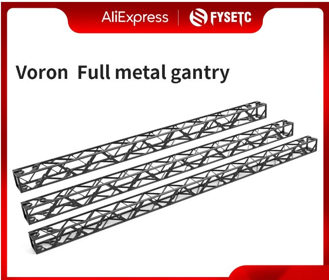
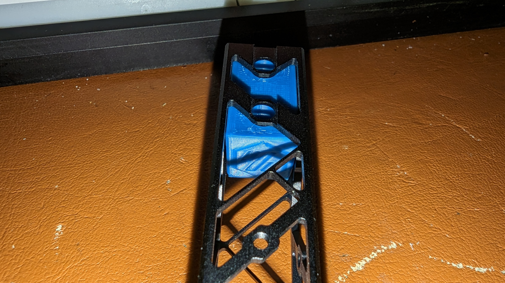
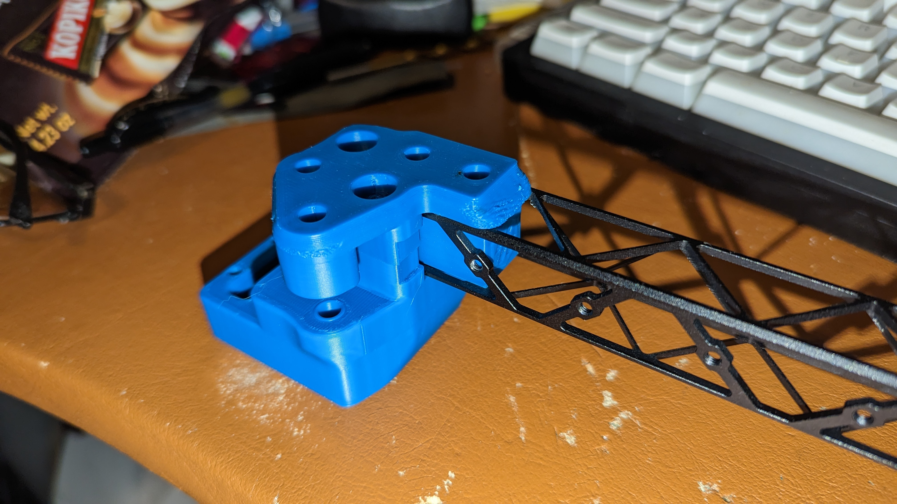
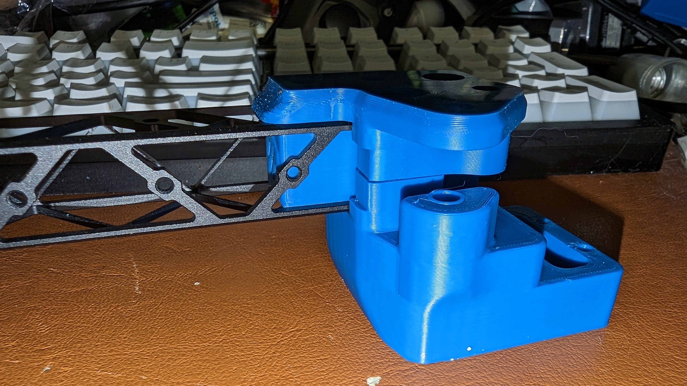

# M5 Insert Block for Fystec Voron 2.4R2 Full Metal Gantry 
This is a printed insert part for mounting the Fystec Voron Full Metal  ~~Alchemist~~ Gantry on a Voron 2.4R2 or Trident or v0.1 Printer.

Product link: https://www.aliexpress.us/item/3256804719096286.html

Fystec's version of their block: https://www.thingiverse.com/thing:5671339

My mounting block takes the same M5 heat inserts that Fystec includes, M5x0.8, 7mm diameter x 5mm or 6mm tall.

Amazon: https://www.amazon.com/M5x5-8mm-OD7-1mm-Threaded-Plastic-Staking/dp/B08T9W17CR

Fystec only includes 6 inserts, 3 for each end.

You can optionally add a 4th insert with a short M5 screw on the bottom side of the gantry bar.

## Files

[CAD](CAD)

[STL](STL)

## Pictures

